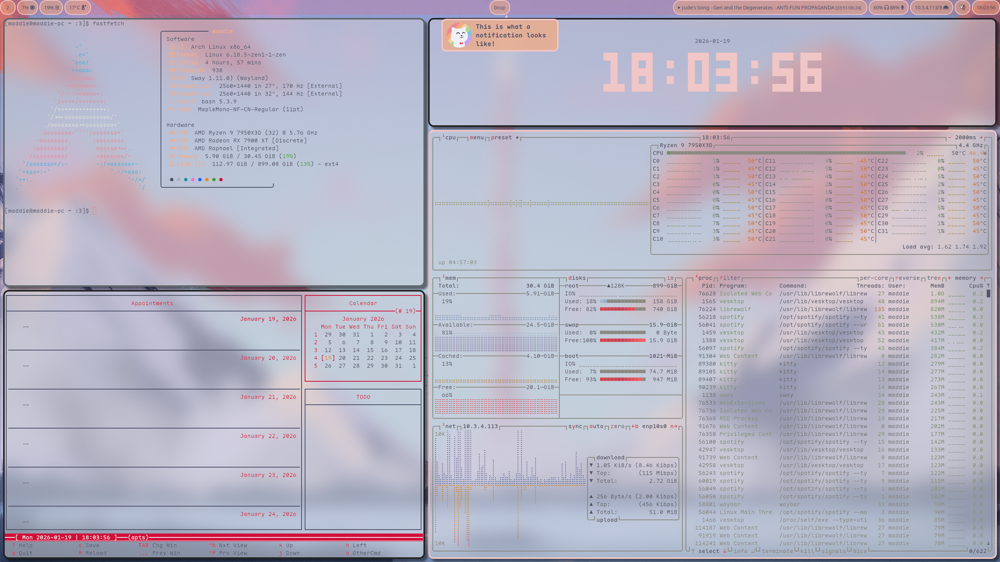
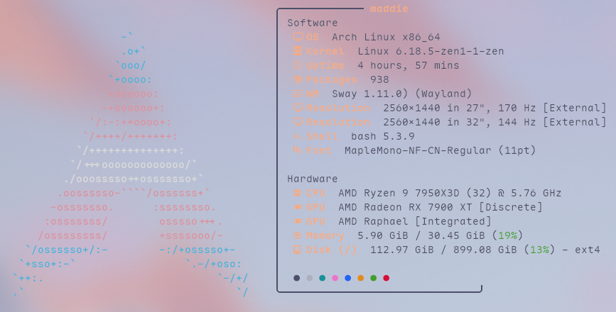

# Madelinux's SwayFX dotfiles
These are just my dotfiles for SwayFX. The theme is mostly Catppuccin Latte with some of the colors from Macchiato.
The wallpaper is by u/MoeWanders on Reddit.
This contains themes for
- SwayFX
- Mako
- Fastfetch
- Waybar
- Fuzzel
- Kitty

If you would like configs for anything else just create an issue and I'll probably add it. 
Keep in mind you will have to edit the config to use your preferred browser if it's not Firefox. 
Also I have only tested this on Arch Linux and I see no reason why it wouldn't work on other distros but just keep in mind that it wasn't tested on anything else.
   
<h1>Dependencies</h1>
<ul>
  <li>swayfx</li>
  <li>swaybg</li>
  <li>otf-font-awesome</li>
  <li>maple-mono-nf-cn-unhinted (Only if you want to use the same terminal font, but you do have to edit the fuzzel and waybar configs if you don't have it.)</li>
</ul>
<h1>Examples</h1>

